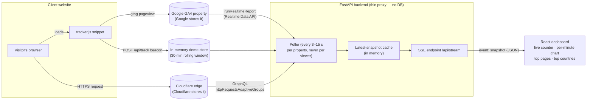

# Realtime Traffic Tracker — a "no-database" web-analytics PoC

A minimal proof of concept for real-time website analytics **without storing any
raw data in a database of our own**: visitors' pageviews flow into
infrastructure that already exists (your GA4 property, Cloudflare's edge, or a
local in-memory demo store), a thin FastAPI proxy polls it back out, and a React
dashboard shows live numbers over Server-Sent Events — seconds-fresh in demo/GA4
mode.

```
make setup   # once: python venv + npm install
make run     # build the dashboard, start everything on http://localhost:8000
```

Open **http://localhost:8000** (the dashboard), then **http://localhost:8000/demo**
(a fake "client website") in a few extra tabs — the live counter moves within
seconds. No credentials, no configuration, no database.

---

## Architecture



One `Snapshot` JSON shape is the contract everywhere: whichever provider is
active fills `{source, fetched_at, active_users, per_minute[30], top_pages,
top_countries, notes}` and the UI never cares where the numbers came from.

## The three data paths

Switch with `ANALYTICS_PROVIDER` in `.env` (copy `.env.example`). Demo mode is
the default and needs nothing.

### 1. `mock` — local demo (default)

The demo site at `/demo` carries the same one-line snippet a real client would
paste:

```html
<script defer src="https://YOUR-POC-HOST/tracker.js" data-site="acme-prod"></script>
```

`tracker.js` beacons each pageview (`sendBeacon`, `text/plain` body → no CORS
preflight) to `POST /api/track`, which appends it to an in-memory 30-minute
rolling window mimicking GA4 realtime semantics (active users = unique visitor
ids in the last 5 minutes). A background simulator (disable with
`SIMULATE_TRAFFIC=false`) generates ambient fake traffic so the dashboard is
alive immediately; your own tabs show up as country "Local".

### 2. `ga4` — Google Analytics 4 Realtime Data API (seconds-fresh)

The production-shaped path: give each client a snippet with a Measurement ID
(`data-ga4="G-XXXXXXXXXX"` makes `tracker.js` also load real gtag), events land
in a GA4 property, and the backend reads them back with the **Realtime Data
API** — events appear seconds after being sent, window capped at the last 30
minutes.

Setup:

1. In Google Cloud: create a project, enable the **Google Analytics Data API**,
   create a service account, download its JSON key.
2. In GA4 Admin → Property access management: add the service account's
   `…iam.gserviceaccount.com` email as **Viewer**.
3. In `.env`:
   ```
   ANALYTICS_PROVIDER=ga4
   GA4_PROPERTY_ID=501234567
   GOOGLE_APPLICATION_CREDENTIALS=./ga4-service-account.json
   GA4_MEASUREMENT_ID=G-XXXXXXXXXX   # optional: demo site dual-sends to GA4 too
   ```

Each poll tick issues exactly three `runRealtimeReport` POSTs
(`https://analyticsdata.googleapis.com/v1beta/properties/{id}:runRealtimeReport`),
in parallel — there is no batch endpoint:

| Purpose | Body (abridged) |
|---|---|
| Active users + top countries | `{"dimensions":[{"name":"country"}],"metrics":[{"name":"activeUsers"}],"minuteRanges":[{"startMinutesAgo":4,"endMinutesAgo":0}]}` |
| Per-minute chart | `{"dimensions":[{"name":"minutesAgo"}],"metrics":[{"name":"screenPageViews"}],"minuteRanges":[{"startMinutesAgo":29,"endMinutesAgo":0}]}` |
| Top pages | `{"dimensions":[{"name":"unifiedScreenName"}],"metrics":[{"name":"screenPageViews"}],…,"limit":10}` |

Two gotchas the code handles: `activeUsers` must never be summed across
minutes (a user active in 3 minutes would count 3×; total comes from the
country call instead), and `minutesAgo` arrives as zero-padded strings with
zero-traffic minutes absent, so the series builder gap-fills.

### 3. `cloudflare` — GraphQL Analytics API (~1–5 min fresh)

For sites already proxied through Cloudflare (orange-cloud): zero tagging
needed. The client creates an API token scoped **Zone → Analytics → Read** and
shares the Zone ID:

```
ANALYTICS_PROVIDER=cloudflare
CF_API_TOKEN=…
CF_ZONE_ID=0123456789abcdef0123456789abcdef
```

One GraphQL POST per tick queries `httpRequestsAdaptiveGroups` grouped by
`datetimeMinute`/`clientCountryName` (plus an aliased selection by
`clientRequestPath`), filtered to HTML responses so counts approximate page
loads. The dataset is **adaptively sampled**: every number is multiplied by the
row's `sampleInterval` and labeled an estimate in the dashboard's footnotes.
"Active users" is approximated from estimated visits in the last 5 minutes.

## Why it's built this way

- **The browser never talks to GA4/Cloudflare directly.** Credentials would
  leak and quota would scale with viewers. Instead the backend polls **per
  property** (default 15 s for real providers) and every dashboard viewer is
  served from the same cached snapshot. Quota math: GA4 standard allows 40k
  realtime tokens/hour and 10 concurrent requests per property — this polls
  ~720 small requests/hour (3 concurrent); Cloudflare allows ~300 GraphQL
  queries per 5 minutes — this sends 20.
- **SSE, not WebSockets or client polling.** The feed is one-directional;
  `EventSource` gives auto-reconnect for free over plain HTTP. The stream sends
  a snapshot on connect, one per poll tick, and a keep-alive comment every 15 s.
  (Deliberately no gzip middleware — compression buffers SSE.)
- **No database.** Google/Cloudflare are the system of record; the backend
  holds exactly one `Snapshot` in memory per property plus a bounded queue per
  connected dashboard. Restart the process and nothing of value is lost.

## HTTP surface

| Route | What |
|---|---|
| `GET /` | React dashboard (built to `frontend/dist`, served statically) |
| `GET /api/snapshot` | Latest snapshot JSON (503 until the first poll lands) |
| `GET /api/stream` | SSE stream of `event: snapshot` frames |
| `POST /api/track` | Pageview beacon ingest (demo pipeline) |
| `GET /api/status` | Provider, poll health, SSE client count, config sanity |
| `GET /tracker.js` | The embeddable snippet |
| `GET /demo`, `/demo/{page}` | Fake client website carrying the snippet |

## Environment variables

| Var | Default | Meaning |
|---|---|---|
| `ANALYTICS_PROVIDER` | `mock` | `mock` \| `ga4` \| `cloudflare` |
| `PORT` | `8000` | HTTP port (`make run`) |
| `POLL_INTERVAL_SECONDS` | 3 mock / 15 real | Upstream poll cadence |
| `SIMULATE_TRAFFIC` | `true` | Demo-mode ambient traffic generator |
| `GA4_PROPERTY_ID` | — | Numeric GA4 property id |
| `GOOGLE_APPLICATION_CREDENTIALS` | — | Service-account JSON key path |
| `GA4_MEASUREMENT_ID` | — | Makes demo site/tracker dual-send to GA4 |
| `CF_API_TOKEN` | — | Token scoped Zone → Analytics → Read |
| `CF_ZONE_ID` | — | Cloudflare zone tag |

## Development

```
make dev    # uvicorn --reload on :8000  +  Vite HMR on :5173 (proxied /api, /demo, /tracker.js)
make test   # pytest over the pure snapshot builders (GA4 gap-fill, CF un-sampling, mock window)
```

Layout: `backend/app` (FastAPI: `config` → `providers/{mock,ga4,cloudflare}` →
`poller` → `bus` → `main`), `backend/static` (tracker.js + demo site),
`frontend/src` (React dashboard: `useSnapshot` SSE hook + five small
components, hand-rolled SVG chart — no chart library).

## From PoC to production

Each in-memory piece has an obvious hardened counterpart:

| PoC | Production |
|---|---|
| One process, snapshot in a dict | **Redis** cache + pub/sub so any replica can serve any SSE client |
| Creds in `.env` | **Secrets Manager/KMS**, per-tenant, encrypted at rest |
| One provider per process | Tenant registry (client → property/zone), one poller per tenant, SSE channels keyed by tenant |
| Open `/api/track` | Rate limiting + origin allowlist per site id |
| `tracker.js` from the app | Served via CDN |
| Eyeballing quota | Monitor `propertyQuota` returned by `runRealtimeReport` (`returnPropertyQuota: true` is already set) |

## Known limitations (by design, for the PoC)

- GA4's realtime window is the **last 30 minutes only**, and realtime
  dimensions exclude page *paths* (`unifiedScreenName` returns page titles) and
  source/medium.
- Cloudflare numbers are **sampled estimates** and lag ~1–5 minutes; the zone
  must be orange-cloud proxied.
- Demo-mode state (and the snapshot cache) lives in one process — that's the
  point of the no-database posture, but it means restarts clear the demo window.
- Routing many clients' visitors into GA4 properties you control has ToS/GDPR
  implications worth legal review before production use.
