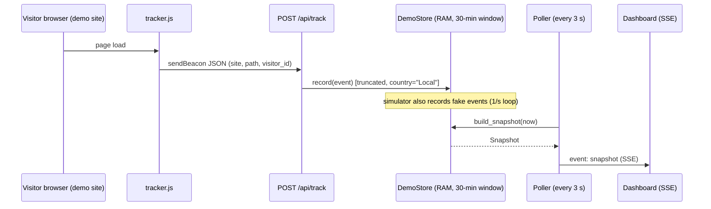
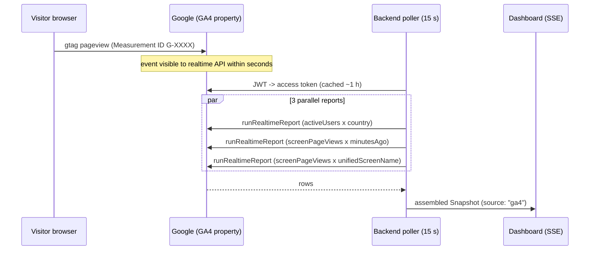

# Vendor Integrations & Security Review

This document is the deep-dive companion to the [README](../README.md): how every
vendor is (or would be) connected — exact console steps, exact HTTP requests,
how each response maps onto the dashboard — plus the cautions per vendor and a
full security review of the embeddable tracking script and the backend surface
(XSS, CSRF, data poisoning, DoS, supply chain, privacy).

**Contents**

1. [The integration model](#1-the-integration-model)
2. [Vendor: local demo store](#2-vendor-local-demo-store-mock)
3. [Vendor: Google Analytics 4 — Realtime Data API](#3-vendor-google-analytics-4--realtime-data-api)
4. [Vendor: Cloudflare — GraphQL Analytics API](#4-vendor-cloudflare--graphql-analytics-api)
5. [Roadmap vendors (not wired yet)](#5-roadmap-vendors-not-wired-yet)
6. [Security review](#6-security-review)

---

## 1. The integration model

Every vendor plugs in behind one interface
([`backend/app/providers/base.py`](../backend/app/providers/base.py)): a provider
answers one question per poll tick — *what does traffic look like right now?* —
by returning a `Snapshot` ([`backend/app/schema.py`](../backend/app/schema.py)):

```json
{
  "source": "ga4",
  "fetched_at": "2026-08-25T00:12:34Z",
  "window_minutes": 30,
  "active_users": 14,
  "active_window_minutes": 5,
  "per_minute": [{"minutes_ago": 29, "pageviews": 21}, "… always exactly 30 …"],
  "top_pages": [{"name": "/pricing", "value": 133}],
  "top_countries": [{"name": "United States", "value": 5}],
  "notes": ["caveats the UI must display"]
}
```

The poller ([`backend/app/poller.py`](../backend/app/poller.py)) calls the active
provider on a fixed cadence **per property — never per dashboard viewer** — and
publishes into an in-memory bus that fans out over SSE. Two consequences:

- **Vendor quota cost is constant** no matter how many people watch the dashboard.
- **Nothing is persisted on our side.** The vendor is the system of record; we
  hold one snapshot in RAM. A crash loses nothing that matters.

Vendor selection is explicit: `ANALYTICS_PROVIDER=mock|ga4|cloudflare`. Missing
or malformed credentials abort startup with a message naming the exact variable
(see [`config.validate`](../backend/app/config.py)) — a misconfigured deployment
never half-works silently.

---

## 2. Vendor: local demo store (`mock`)

**What it is.** Not an external vendor — a local stand-in that mimics GA4
realtime semantics so the entire pipeline runs with zero credentials. It's also
the ingest target for the tracking snippet's beacon, which makes it the model
for how a first-party "we host the analytics" path would work.

**Connection: nothing.** It is the default. Data comes from two feeds into one
in-memory 30-minute rolling window ([`providers/mock.py`](../backend/app/providers/mock.py)):



**Cautions**

| Caution | Detail |
|---|---|
| Volatile | Restart = empty window. By design (no-database posture), but never make business decisions from demo mode. |
| Single-process | The store is process-local; running multiple workers would split the data. Run one worker, or move to a real provider. |
| Open ingest | Anyone who can reach the host can POST events (bounded: 4 KB/beacon, 50 000-event ring buffer). Fine locally; see [§6.5](#65-data-poisoning--spam) before exposing publicly. |
| Simulator on by default | `SIMULATE_TRAFFIC=false` when you want only real beacons. |

---

## 3. Vendor: Google Analytics 4 — Realtime Data API

**The path:** your site carries gtag with your Measurement ID → pageviews land
in your GA4 property (Google stores them) → this backend reads them back with
`runRealtimeReport`, which reflects events **seconds** after they're sent,
within a rolling **last-30-minutes** window.

### 3.1 What you need

| Thing | Where it comes from | Example |
|---|---|---|
| GA4 **Property ID** (numeric) | GA4 Admin → Property → Property settings | `501234567` |
| **Service-account JSON key** | Google Cloud console (below) | `ga4-service-account.json` |
| SA email added as **Viewer** | GA4 Admin → Property access management | `poc-reader@myproj.iam.gserviceaccount.com` |
| *(optional)* **Measurement ID** | GA4 Admin → Data streams → your web stream | `G-AB12CD34EF` |

### 3.2 One-time console setup

**Google Cloud** (your side — the client never touches this):

1. [console.cloud.google.com](https://console.cloud.google.com) → create a project (or reuse one).
2. APIs & Services → Library → enable **Google Analytics Data API**.
3. IAM & Admin → Service Accounts → **Create service account** (no project roles
   needed — access is granted inside GA4, not IAM).
4. Open the SA → Keys → Add key → **JSON** → download. Store it outside the repo
   or at repo root — `.gitignore` already excludes `*service-account*` / `*.sa.json` / `.env`.

**GA4** (the property owner's side — this is the *only* thing a client does):

5. [analytics.google.com](https://analytics.google.com) → Admin → Property →
   **Property access management** → **+** → Add users → paste the SA email →
   role **Viewer** → untick "Notify by email" → Add.
6. Copy the numeric **Property ID** from Property settings.

**Backend:**

```env
ANALYTICS_PROVIDER=ga4
GA4_PROPERTY_ID=501234567
GOOGLE_APPLICATION_CREDENTIALS=./ga4-service-account.json
GA4_MEASUREMENT_ID=G-AB12CD34EF    # optional: demo site / tracker dual-sends to GA4
```

### 3.3 How auth works ([`providers/ga4.py`](../backend/app/providers/ga4.py))

`google-auth` signs a JWT with the SA private key and exchanges it at
`oauth2.googleapis.com/token` for a **~1-hour access token**, scoped
`https://www.googleapis.com/auth/analytics.readonly` (read-only — the token
cannot modify the property even if leaked). The provider refreshes lazily off
the event loop (`asyncio.to_thread`) and sends `Authorization: Bearer <token>`.

### 3.4 The exact API calls — 3 per tick, in parallel

All three POST to
`https://analyticsdata.googleapis.com/v1beta/properties/{PROPERTY_ID}:runRealtimeReport`
(the realtime API has **no batch endpoint**), fired with `asyncio.gather` —
3 concurrent vs Google's limit of 10.

**Call 1 — total active users + top countries** (5-minute window):

```json
{
  "dimensions": [{"name": "country"}],
  "metrics": [{"name": "activeUsers"}],
  "minuteRanges": [{"startMinutesAgo": 4, "endMinutesAgo": 0}],
  "orderBys": [{"metric": {"metricName": "activeUsers"}, "desc": true}],
  "limit": 250,
  "returnPropertyQuota": true
}
```

**Call 2 — per-minute chart series** (30-minute window):

```json
{
  "dimensions": [{"name": "minutesAgo"}],
  "metrics": [{"name": "screenPageViews"}],
  "minuteRanges": [{"startMinutesAgo": 29, "endMinutesAgo": 0}]
}
```

**Call 3 — top pages:**

```json
{
  "dimensions": [{"name": "unifiedScreenName"}],
  "metrics": [{"name": "screenPageViews"}],
  "minuteRanges": [{"startMinutesAgo": 29, "endMinutesAgo": 0}],
  "orderBys": [{"metric": {"metricName": "screenPageViews"}, "desc": true}],
  "limit": 10
}
```

**Response shape** (call 2, abridged) and how it maps:

```json
{
  "dimensionHeaders": [{"name": "minutesAgo"}],
  "metricHeaders": [{"name": "screenPageViews", "type": "TYPE_INTEGER"}],
  "rows": [
    {"dimensionValues": [{"value": "00"}], "metricValues": [{"value": "12"}]},
    {"dimensionValues": [{"value": "07"}], "metricValues": [{"value": "3"}]}
  ],
  "rowCount": 2
}
```

| Snapshot field | Source | Non-obvious rule (unit-tested) |
|---|---|---|
| `active_users` | call 1: **sum over country rows** | Never sum `activeUsers` across *minutes* — a user active in 3 minutes would count 3×. A user occupies exactly one country, so that sum is the true total. |
| `per_minute` | call 2 | `minutesAgo` arrives as zero-padded **strings** (`"00"`…`"29"`) and zero-traffic minutes are **absent** — the builder int-parses and gap-fills to exactly 30 buckets. |
| `top_countries` | call 1 rows (top 10) | |
| `top_pages` | call 3 rows | `unifiedScreenName` is the page **title** — the realtime API exposes no `pagePath`. Surfaced as a note. |



### 3.5 Failure modes

| Symptom | Meaning | Fix |
|---|---|---|
| `403 PERMISSION_DENIED` | SA not added as Viewer, or Data API not enabled in your GCP project | Redo §3.2 steps 2 / 5 |
| `404` / `400 INVALID_ARGUMENT` on property | Wrong Property ID (e.g. a `G-…` measurement id was pasted) | Use the *numeric* id; startup validation rejects non-numeric values |
| `401 UNAUTHENTICATED` | Key revoked/rotated | Issue a new JSON key |
| `429 RESOURCE_EXHAUSTED` | Realtime token quota exhausted | Raise `POLL_INTERVAL_SECONDS`; check `propertyQuota` (already requested via `returnPropertyQuota`) |
| Dashboard shows zeros but no errors | Property receives no traffic, or events lack the realtime window | Confirm gtag fires on the site (GA4's own Realtime view should agree) |

On any failure the poller logs, surfaces the error in `GET /api/status`
(`last_poll_error`), and keeps serving the last good snapshot — one bad tick
never blanks the dashboard.

**Pre-flight check without starting the app** (mints a token and runs call 1):

```bash
TOKEN=$(.venv/bin/python -c "
from google.oauth2 import service_account
from google.auth.transport.requests import Request
c = service_account.Credentials.from_service_account_file(
    'ga4-service-account.json',
    scopes=['https://www.googleapis.com/auth/analytics.readonly'])
c.refresh(Request()); print(c.token)")
curl -s -H "Authorization: Bearer $TOKEN" -H "Content-Type: application/json" \
  -d '{"metrics":[{"name":"activeUsers"}]}' \
  "https://analyticsdata.googleapis.com/v1beta/properties/501234567:runRealtimeReport"
```

### 3.6 Cautions

- **The SA key is the crown jewel.** Anyone holding it reads every property the
  SA was granted. Keep it out of git (already ignored), move to a secrets
  manager for any deployment, rotate periodically, and use **one SA per client**
  in a multi-tenant setup so revocation is per-client and a leak exposes one
  tenant, not all.
- **Viewer role only.** Never grant Editor/Admin; `analytics.readonly` scope
  plus Viewer keeps the blast radius at "read analytics".
- **Quota discipline.** ~720 requests/hour at a 15 s interval costs a few
  thousand of the 40 000 realtime tokens/hour/property. The cached-snapshot
  fan-out is what keeps viewers from multiplying this. **Never** spin up extra
  GCP projects to stretch quota — Google's API ToS explicitly forbids
  circumventing limits with multiple projects/accounts.
- **Realtime API limits are real:** 30-minute window (60 for Analytics 360), no
  `pagePath`, no source/medium, no event-scoped custom dimensions. If you need
  more, that's the Core API (24–48 h latency) or a different vendor.
- **Under-counting is structural.** Ad-blockers and tracking protection block
  gtag for a meaningful share of visitors (commonly estimated 15–30 %,
  audience-dependent). Numbers are directional, not audited truth.
- **Privacy/ToS (serious one).** If *clients'* visitors flow into a GA4 property
  *you* control, you become a data controller/processor for that traffic:
  GDPR/CCPA disclosure, a DPA with each client, and Google Consent Mode for
  EEA visitors are on you. Fine for a PoC with your own site; get legal review
  before running it for customers.

---

## 4. Vendor: Cloudflare — GraphQL Analytics API

**The path:** the site is proxied through Cloudflare ("orange cloud"), so
Cloudflare's edge already logs every request. **Zero site changes** — the
backend reads aggregated analytics with a scoped token. Freshness is ~1–5
minutes (vs seconds for GA4); minimum granularity is one minute.

### 4.1 What you need

| Thing | Where | Format |
|---|---|---|
| **Zone ID** | dash.cloudflare.com → your site → Overview → API box (right column) | 32 hex chars (validated at startup) |
| **API token** | Profile → API Tokens (below) | `Bearer`-style secret |
| Site proxied through CF | DNS records show the orange cloud | — |

### 4.2 Creating the token (least privilege)

1. dash.cloudflare.com → My Profile → **API Tokens** → Create Token → **Custom token**.
2. Permissions: **Zone → Analytics → Read**. Nothing else.
3. Zone Resources: **Include → Specific zone → your site** (not "All zones").
4. Recommended: set a **TTL** and, if your backend has stable egress IPs,
   **Client IP Address Filtering**.
5. Create, copy once, put in `.env`:

```env
ANALYTICS_PROVIDER=cloudflare
CF_API_TOKEN=<token>
CF_ZONE_ID=0123456789abcdef0123456789abcdef
```

Never use the legacy **Global API Key** — it is account-wide and unscoped.

### 4.3 The exact API call — 1 POST per tick, 2 aliased selections

`POST https://api.cloudflare.com/client/v4/graphql` with
`Authorization: Bearer <CF_API_TOKEN>`
([`providers/cloudflare.py`](../backend/app/providers/cloudflare.py)):

```graphql
query Traffic($zoneTag: String!, $since: Time!) {
  viewer {
    zones(filter: { zoneTag: $zoneTag }) {
      series: httpRequestsAdaptiveGroups(
        limit: 500
        filter: { datetime_geq: $since, edgeResponseContentTypeName: "html" }
      ) {
        count
        avg { sampleInterval }
        sum { visits }
        dimensions { datetimeMinute clientCountryName }
      }
      paths: httpRequestsAdaptiveGroups(
        limit: 200
        filter: { datetime_geq: $since, edgeResponseContentTypeName: "html" }
      ) {
        count
        avg { sampleInterval }
        dimensions { clientRequestPath }
      }
    }
  }
}
```

Variables: `{"zoneTag": CF_ZONE_ID, "since": "<now − 30 min>"}`. The
`edgeResponseContentTypeName: "html"` filter is what makes `count` ≈ page loads
instead of every image/CSS/API request the zone serves.

**Response row** (series, abridged):

```json
{
  "count": 120,
  "avg": { "sampleInterval": 4.0 },
  "sum": { "visits": 80 },
  "dimensions": { "datetimeMinute": "2026-08-25T00:14:00Z", "clientCountryName": "US" }
}
```

**The un-sampling rule (the one everyone gets wrong).** High-traffic zones are
*adaptively sampled*: a row with `sampleInterval: 4` means Cloudflare kept ~1 in
4 records. Every number must be multiplied back:
`estimate = raw × max(sampleInterval, 1)` → the row above represents
**~480 requests / ~320 visits**, an *estimate*. The dashboard's footnotes say so.

| Snapshot field | Derivation |
|---|---|
| `per_minute` | est. `count` summed across countries per `datetimeMinute`, bucketed to `minutes_ago` 0–29, gap-filled |
| `active_users` | est. `visits` summed over the last 5 minutes — an **approximation**, labeled in `notes` |
| `top_countries` / `top_pages` | est. visits/count per country/path over the 30-min window, top-10 sorted in Python |

**Pre-flight check:**

```bash
curl -s https://api.cloudflare.com/client/v4/graphql \
  -H "Authorization: Bearer $CF_API_TOKEN" -H "Content-Type: application/json" \
  -d '{"query":"query($z:String!,$s:Time!){viewer{zones(filter:{zoneTag:$z}){httpRequestsAdaptiveGroups(limit:5,filter:{datetime_geq:$s}){count dimensions{datetimeMinute}}}}}",
       "variables":{"z":"<ZONE_ID>","s":"2026-08-25T00:00:00Z"}}'
```

An empty `zones: []` with no error = token valid but not scoped to that zone.

### 4.4 Failure modes

| Symptom | Meaning | Fix |
|---|---|---|
| `authentication error` in `errors[]` | Bad/expired token | Reissue (tokens with TTL expire silently) |
| `zones: []` | Token not scoped to this zone, or wrong Zone ID | Recheck §4.2 step 3 and the 32-hex id |
| Rows exist but tiny numbers | You forgot to multiply by `sampleInterval` | The provider does this; if you query manually, you must too |
| Newest 1–2 minutes always low | 1–5 min ingest lag | Expected; noted in the UI, not worked around |
| Everything zero, site loads fine | Zone is **grey-cloud** (DNS only) | Enable the proxy (orange cloud) — without it there is *no* HTTP analytics |

### 4.5 Cautions

- **Estimates, always.** Sampling means numbers are statistically scaled, and
  `visits` is Cloudflare's session heuristic, not deduplicated humans. Don't
  present them as exact counts (the UI footnotes exist for this reason).
- **Bots are included.** Edge request counts include crawlers/scanners that GA4
  (JS-based) never sees — Cloudflare numbers will read *higher* than GA4 for
  the same site. Bot-score filtering exists on higher plans if it matters.
- **Hard dependency on proxying.** Grey-cloud or non-Cloudflare DNS = this
  entire path returns nothing. Detect before onboarding (a `cf-ray` response
  header on the site = proxied).
- **Token hygiene:** Analytics:Read only, single zone, TTL, IP-filtered,
  rotated. The Zone ID is not secret, the token absolutely is.
- **Rate limit** is ~300 GraphQL queries per 5 minutes account-wide; this
  integration uses 20. Leave headroom if the same account runs other tooling.
- **Plan differences:** available datasets, retention and max query range vary
  by plan; `httpRequestsAdaptiveGroups` works on Free, but don't assume every
  dataset in the docs exists for the client's plan.

---

## 5. Roadmap vendors (not wired yet)

From the original research; none of these are in the codebase today. Recorded
here so the connection story is complete.

| Vendor | How it would connect | Chief caution |
|---|---|---|
| **Cloudflare Workers Analytics Engine** | A Worker on the client's zone calls `env.DATASET.writeDataPoint(...)`; backend reads via SQL API (`POST /accounts/{id}/analytics_engine/sql`, Bearer token). The cleanest long-term "no-DB" store: ~seconds fresh, 90-day retention. | Requires deploy access to the client's Cloudflare account — a much bigger ask than a read token. Writes are sampled at high volume. |
| **Google CrUX API** | `POST chromeuxreport.googleapis.com/v1/records:queryRecord` with an API key. Free, 150 req/min. | Not traffic: 28-day rolling Core Web Vitals, ~2 days behind, Chrome users only. Never present as "visitors". |
| **Cloudflare Radar** | `GET api.cloudflare.com/client/v4/radar/ranking/domain/{domain}` with a free token. Popularity ranks for arbitrary domains. | Licensed **CC BY-NC 4.0** — *non-commercial*. A paid product surfacing Radar data needs a licensing answer first. |
| **SimilarWeb** | REST API, quote-only contract pricing. Modeled monthly estimates for arbitrary domains. | Expensive; accuracy degrades sharply below ~100 K monthly visits (their own docs) and independent studies show 19–39 % average deviation. Label as modeled estimates, gate behind your own paid tier. |

The rule that falls out of the research: **for a URL you don't own there is no
live data at any price** — only modeled estimates and ranks. Anything "live"
requires the snippet (§2/§3) or infrastructure access (§4).

---

## 6. Security review

### 6.1 Scope and method

Reviewed by reading every line of the exposed surface — this is a small,
fully-auditable system:

- [`backend/static/tracker.js`](../backend/static/tracker.js) — the script third-party sites embed (~60 lines)
- All FastAPI routes in [`backend/app/main.py`](../backend/app/main.py)
- The dashboard's rendering of vendor-supplied strings (`frontend/src`)
- Config/credential handling ([`backend/app/config.py`](../backend/app/config.py), `.gitignore`)

Threat actors considered: a malicious *visitor* of a tracked site, a malicious
*third party* on the internet (can reach the backend), a *compromised tracker
host* (supply chain), and a careless *operator* (misconfiguration).

Three fixes were applied as a result of this review — marked **[FIXED]** below.

### 6.2 `tracker.js` — line-by-line threat review

The script runs inside client pages, so its bar is "must be provably inert".
Everything it does:

| Behavior | Security property |
|---|---|
| `document.currentScript` + `new URL(script.src).origin` | Backend origin is derived from where the script was *actually loaded from* — it cannot be redirected by page content. |
| Reads `data-site` / `data-ga4` attributes | Attacker-controlled only by someone who can already edit the page's HTML — who could simply write their own `<script>` instead. No privilege gained. |
| `sessionStorage` visitor id (`crypto.randomUUID`) | Random UUID, **per tab**, dies with the tab. Not a cookie, not readable cross-site, no fingerprinting inputs. Wrapped in try/catch (Safari private mode throws). |
| gtag injection: `g.src = "https://www.googletagmanager.com/gtag/js?id=" + encodeURIComponent(ga4)` | Host is **hard-coded**; the id is URL-encoded so it cannot smuggle a different host, path, or extra params. |
| `navigator.sendBeacon(origin + "/api/track", jsonString)` (+`fetch` fallback) | Plain-string body ⇒ `text/plain` ⇒ CORS "simple request". Fire-and-forget; response is never read, so nothing from the backend flows back into the page. |

**What it never does:** no `innerHTML`, no `document.write`, no `eval`/`Function`,
no reading of cookies, forms, or DOM content, no third-party hosts other than
the optional, hard-coded Google tag. There is **no DOM-XSS sink and no data
exfiltration path** in the script itself.

Residual notes:

- It sends `document.referrer`, which can contain sensitive prior-page URLs.
  The backend currently **discards** it (only `visitor_id`/`path` are stored).
  If you ever store it, truncate to the referrer's *origin* first.
- A client site with a Content-Security-Policy needs:
  `script-src https://your-poc-host` (+ `https://www.googletagmanager.com` if
  dual-sending) and `connect-src https://your-poc-host` (sendBeacon obeys
  `connect-src`).

### 6.3 XSS analysis

**a) DOM XSS in the script — none** (§6.2: no sinks).

**b) Stored XSS via beacon → dashboard — the classic analytics hole, checked
carefully.** `path` and `visitor_id` are *arbitrary attacker strings*: anyone
can `curl -d '{"path":""}' /api/track` and that
string later appears in the dashboard's Top Pages list. This exact vector (spam
with HTML payloads in referrer/page names) has burned real analytics products.
Here it is **not exploitable** because the dashboard is React and every
vendor/beacon string is rendered as JSX text (`{item.name}`) or a JSX attribute
(`title={item.name}`) — both auto-escaped; `dangerouslySetInnerHTML` appears
nowhere in the frontend. The JSON API and SSE frames are also safe carriers:
pydantic's JSON encoder escapes newlines, so a crafted `path` cannot break SSE
`data:` framing either.
**Standing rule:** every string in a `Snapshot` (`top_pages[].name`,
`top_countries[].name`, `notes[]`) is untrusted display data — any future
consumer (email digests, a non-React widget, server-rendered reports) must
escape it. This includes GA4-sourced strings: `unifiedScreenName` is the page
*title*, which on many sites reflects user input.

**c) Server-side HTML substitution.** `/demo` pages inject the measurement id
via `html.replace("__GA4_ATTR__", …)` — an HTML-attribute context. The value
comes from an env var (operator-controlled, not request-controlled), so it was
never remotely exploitable; **[FIXED]** regardless, startup now rejects any
`GA4_MEASUREMENT_ID` not matching `^G-[A-Z0-9]{4,20}$`, so the substituted
value is inert by construction (also catches pasted-the-wrong-id typos, the
common real-world failure).

**d) Everything else served** is static files or JSON endpoints with correct
content types, and **[FIXED]** all responses now carry
`X-Content-Type-Options: nosniff` (plus `X-Frame-Options: DENY` and
`Referrer-Policy: same-origin`) via a pure-ASGI middleware that cannot buffer
the SSE stream.

### 6.4 CSRF analysis

Classic CSRF = tricking a *victim's browser* into making a state-changing
request that rides the victim's **ambient credentials** (cookies/session).
This system has **no cookies, no sessions, no authenticated state-changing
route** — there is no credential to ride and nothing to forge:

| Route | State-changing? | Ambient auth? | CSRF verdict |
|---|---|---|---|
| `POST /api/track` | yes (writes an event) | none — deliberately public; a "forged" cross-site POST *is the product* | Not CSRF — the real risk is **unauthenticated spam**, treated in §6.5 |
| `GET /api/snapshot`, `/api/stream`, `/api/status` | no | none | N/A (GETs, no side effects) |

The moment production adds an authenticated surface (admin panel, tenant
settings), the standard kit applies: `SameSite=Lax/Strict` session cookies,
CSRF tokens on non-GET routes, and `Origin`-header verification. Design note
for that future: keep `/api/track` on a **separate, cookie-less origin**
(e.g. `ingest.yourdomain.com`) so the open beacon endpoint never shares a
cookie jar with anything privileged.

### 6.5 Data poisoning / spam

The honest cost of an open beacon: **anyone can inflate your numbers** — a curl
loop can fake thousands of "visitors", plant misleading page names, or sabotage
a competitor's metrics if you host multiple tenants. Every analytics vendor
(GA included — remember referrer spam) lives with a version of this. Current
mitigations: 4 KB body cap **[FIXED]**, field truncation (64/200 chars),
bounded 50 000-event store, forged data confined to the demo provider.
Production additions, in order of value: per-IP rate limit at the proxy
(`limit_req` in nginx), accept only *registered* `site` ids, check `Origin`
against each site's registered domain (stops browser-based spam; curl can spoof
it, hence also rate limits), and drop events whose `path` doesn't match the
site's URL shape. GA4/Cloudflare modes are immune to this endpoint (they never
read the demo store), but have their own equivalent: anyone can send events to
a *public* GA4 Measurement ID too — spam filtering is a vendor-universal
caution, not a flaw unique to self-hosting.

### 6.6 The rest of "and such"

- **DoS.** Beacon bodies were previously buffered unbounded — an attacker could
  POST multi-GB bodies; **[FIXED]** with the Content-Length check + 4 KB
  streaming cap (also fixed: invalid-UTF-8 bodies raised an unhandled 500;
  now treated as an empty beacon). SSE connections cost one bounded queue
  (8 snapshots) each, but connection *count* is uncapped — in production put
  the app behind a reverse proxy with connection/rate limits or run uvicorn
  with `--limit-concurrency`. The event store and per-queue memory are bounded
  by design.
- **Information disclosure.** With CORS `*` and no auth, `/api/snapshot`,
  `/api/stream` and `/api/status` are world-readable on a public host — your
  live business traffic becomes public, and `last_poll_error` echoes upstream
  exception text (which can include the property id in a URL). Accepted for a
  PoC; for production put the dashboard and read APIs behind auth (reverse-proxy
  basic auth is enough to start), scope CORS for read routes to the dashboard
  origin, and keep only `/api/track` + `/tracker.js` public.
- **SSRF — none today, guaranteed tomorrow.** The backend only calls two
  hard-coded hosts (Google, Cloudflare) with operator credentials — no
  user-supplied URLs are fetched. The planned "enter your URL" stack-detector
  is a textbook SSRF vector (fetching attacker-chosen URLs can reach
  `169.254.169.254`, internal services, etc.). When building it: resolve DNS
  first and reject private/link-local/loopback ranges, re-check on every
  redirect (or refuse redirects), pin the resolved IP for the actual request,
  enforce short timeouts and size caps, and fetch from an egress-restricted
  worker if possible.
- **Supply chain (the biggest real-world risk of this product class).** Whoever
  controls the `tracker.js` host can run arbitrary JS on every client site —
  this is exactly the Polyfill.io 2024 incident and the Magecart playbook. The
  PoC's defenses: the script is tiny and diff-able, and serving it from your
  own locked-down origin beats a shared CDN account. For production: immutable
  versioned URLs (`/tracker.v1.js`) so clients can pin, offer an SRI hash
  (`integrity="sha384-…" crossorigin="anonymous"`) for clients who prefer
  integrity over auto-updates, protect the deploy path (2FA, reviewed deploys),
  and monitor the served bytes. Dependency side: Python deps are pinned,
  `package-lock.json` is committed, `npm audit` was clean at commit time — keep
  both under periodic audit.
- **Secrets & config.** `.gitignore` excludes `.env` and every key-file pattern
  the docs mention; startup validation **[FIXED to be strict]** rejects
  malformed ids/tokens' formats early. Never log the SA key or CF token
  (nothing in the code does). Deployment: secrets manager, not env-files on
  disk.
- **Clickjacking.** No sensitive click actions exist, but `X-Frame-Options:
  DENY` now ships anyway **[FIXED]** — the dashboard and demo pages cannot be
  framed.
- **Privacy/GDPR recap** (details in §3.6): the beacon path stores a per-tab
  random id and a path — no cookies, no IP persisted, about as minimal as
  analytics gets; the gtag path invokes Google's full machinery — consent
  banners/Consent Mode are the site owner's obligation; the Cloudflare path
  processes no personal data on our side at all (pre-aggregated).

### 6.7 Endpoint security matrix

| Route | Auth | Attacker-controlled input | Risks considered | Standing mitigations |
|---|---|---|---|---|
| `POST /api/track` | none (by design) | entire body | spam/poisoning, DoS, stored XSS, parse errors | 4 KB cap, truncation, bounded store, React-escaped display, 204-always (no error oracle) |
| `GET /api/stream` | none | none | connection exhaustion, framing injection | bounded per-client queue, JSON-escaped frames, heartbeat + disconnect cleanup |
| `GET /api/snapshot` `/api/status` | none | none | info disclosure | accepted for PoC — auth before public deploy |
| `GET /demo/{page}` | none | `page` path segment | path traversal, injection | dict allowlist (no filesystem paths), validated substitution value |
| `GET /tracker.js` | none | none | supply chain | §6.6; correct MIME + nosniff |
| `GET /` (dashboard) | none | vendor strings via API | XSS | React auto-escaping, no `dangerouslySetInnerHTML` |

### 6.8 Production hardening checklist

Before real business data, in priority order:

1. **Auth on the dashboard + read APIs** (reverse-proxy basic auth is fine to
   start); CORS for read routes scoped to the dashboard origin.
2. **HTTPS everywhere** (terminate TLS at the proxy; HSTS).
3. **Rate limiting** on `/api/track` and SSE connections at the proxy.
4. **Secrets manager** for the SA key / CF token; per-tenant credentials;
   rotation schedule.
5. **Registered site ids + Origin checks** on the beacon.
6. Versioned `tracker.js` URL + published **SRI hash**.
7. **CSP on the dashboard** itself (`default-src 'self'` works — the built app
   has no external resources).
8. Privacy docs: what the beacon stores (per-tab id, path), DPA template if
   multi-tenant, Consent Mode guidance for the gtag path.
9. Structured logging that **redacts** tokens and full upstream error bodies.
10. Periodic `pip audit` / `npm audit` in CI.
